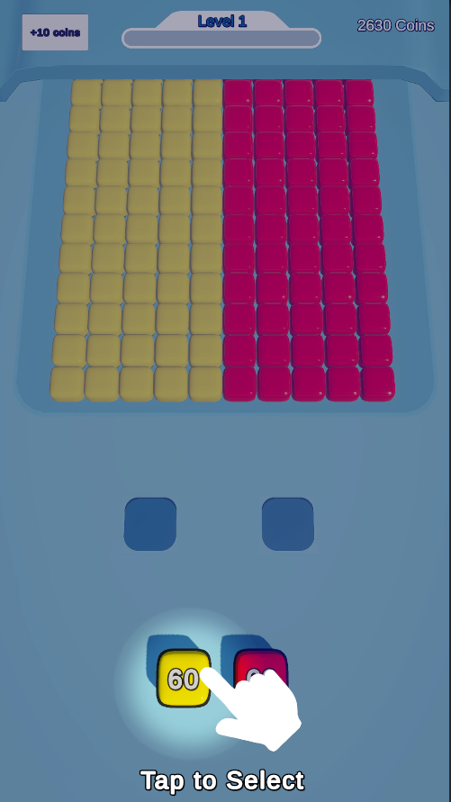
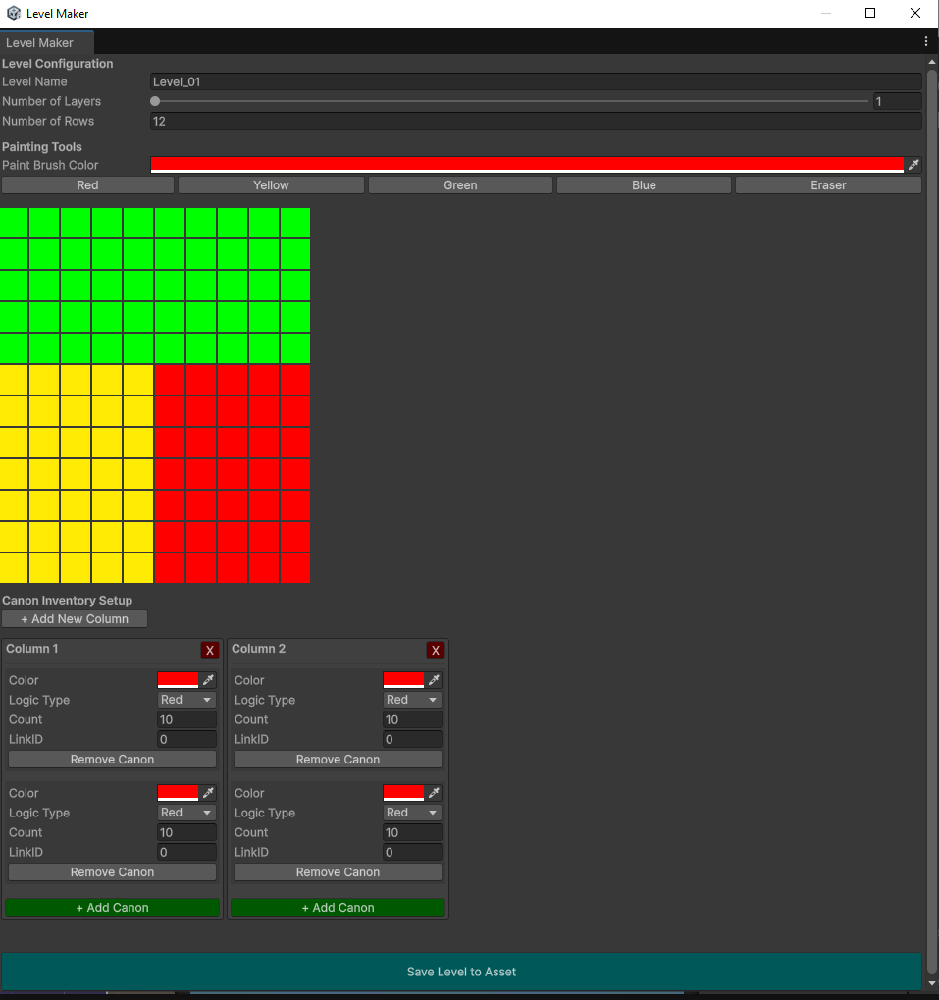

# Block Blaster Extreme

A vibrant, arcade-style block blasting game where strategy meets high-speed action.

  

##  Screenshots

  
  

*Blast through colorful grids strategically!*

## Features
* **Dynamic Grid Generation:** Levels are generated under 2 minutes using Level Editor panel.
* **Special Power-ups:** Fuse 3 blocks of the same color together to free up slot spaces
* **High Score System:** Local save system to track your best runs.

  

##  How to Play

1. Click on / touch the blocks of the desired color strategically.
2. Clear the required number of blocks to advance to the next level.

## Technical Info
* **Unity Version:** 6000.0.50f1 LTS
* **Project Type:** 3D / Universal Render Pipeline (URP)

---
Developed by Ragy (RgHNr)

